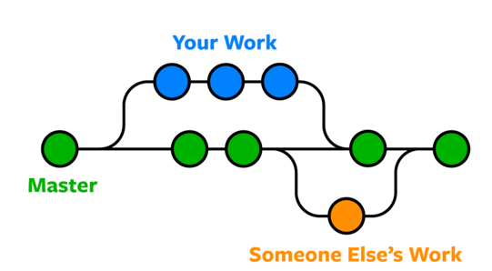

# Git and GitHub Practical Guide

## What is Git and Why is it FUNDAMENTAL?

Git is a distributed version control system that tracks changes to your code. Unlike older systems, Git stores complete snapshots of your project, not just the changes.

### Why Git is Absolutely Essential:

1. **History Tracking**: Like a videogame it allows you to save your progress, if you want revert them, test something and
go back, and check who does what
2. **Parallel Development**: Multiple people can work on the same project simultaneously, without interfering with each other
3. **Experimentation**: Create branches to try new features without affecting the main code
4. **Disaster Recovery**: Roll back to any previous version when things break

**Without Git, professional software development is practically impossible.**

## Git vs. GitHub

- **Git**: The version control system that runs locally on your machine
- **GitHub**: The web-interface service for Git repositories

## Essential Git Commands for the Training

### It's written cloning, it means copying 

```bash
# Go first wher you want the folder with the project to be

cd <wherever_you_want>

# Clone literally means copying
git clone https://github.com/ParviziAH/deployment-study-group.git

# Navigate into the repository
cd deployment-study-group
```

### Checking Repository Status

```bash
# Shows which files are modified, staged, or untracked
git status
```

### Working with Branches
Branches are parallel copies of the project. The main version of your project is `main` (sometimes it's called `master`,
but nothing else changes). When branches get created they create a copy of the project at that moment. 
Until you merge them back together (`git merge`), they remain parallel. 




```bash
# List all branches (* indicates current branch)
git branch

# Create a new branch
git branch feature/new-algorithm

# Switch to a branch.
# If you asked me I would've called git switch, but they opted for checkout
git checkout feature/new-algorithm

# Create and switch to a new branch in one command 
# so that you can save like 1.2 seconds. Crazy ah?
git checkout -b feature/web-dashboard

# Switch back to main branch
git checkout main
```

### Making Changes

```bash
# Choose which MODIFIED files you would like to save. modified files (prepare them for commit)
# NB this is just a seleciton. You haven't saved them yet
git add algorithm.py

# Putting a dot means "all the modified files"
git add .

# Commit (save) the file you just selected changes with a message
git commit -m "Improve restock algorithm logic"

# See commit history
git log
```

### Syncing with GitHub

```bash
# Download changes from GitHub
git pull

# Upload your local commits to GitHub
git push

# Push a new branch to GitHub
git push -u origin feature/new-algorithm
```

### Merging Changes

```bash
# First, switch to the destination branch
git checkout main

# Merge another branch into current branch
git merge feature/new-algorithm

# If there are conflicts, resolve them and then:
git add <resolved-files>
git commit -m "Merge feature/new-algorithm"
```

## Pull Requests (PRs)
The name is confusing. Has nothing to do with a pull. It should've been called Merge Request (MRs).
You're basically proposing changes to a repository.

### Why Pull Requests Matter:

1. **Code Review**: Team members can review your code before it's merged
2. **Discussion**: Provides a space to discuss the implementation
3. **CI/CD Integration**: Automated tests can run on your PR
4. **Documentation**: Creates a record of why changes were made

### Creating a Pull Request:

1. Push your branch to GitHub: `git push -u origin feature/new-algorithm`
2. Go to the repository on GitHub
3. Click "Pull requests" > "New pull request"
4. Select your branch as the compare branch
5. Add description, reviewers, and create the PR

### To keep in mind for during the study:
MAYBE ADD HTE PART WITH THE GITHUB ACTIONS THAT CORRECTS THE MD FILES AFTER A PR
1. Create a feature branch for each exercise
2. Commit your changes to that branch
3. Push the branch to GitHub
4. Create a PR when you're ready for feedback
5. After approval, merge the PR on GitHub
6. Pull the updated main branch locally: `git pull`